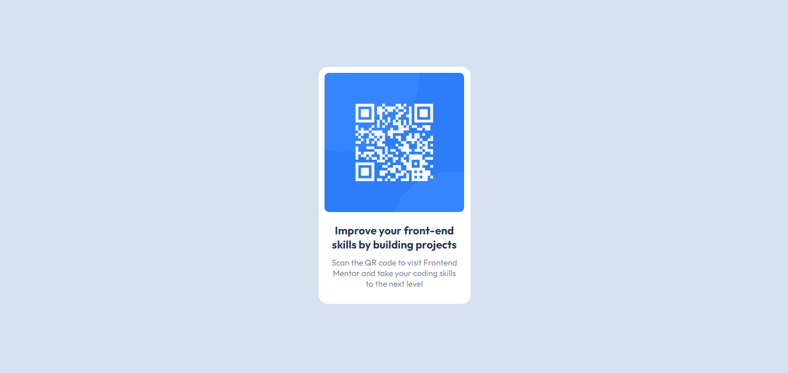

# Frontend Mentor - QR code component

Essa é a solução para o [QR code component challenge on Frontend Mentor](https://www.frontendmentor.io/challenges/qr-code-component-iux_sIO_H). 

Desenvolvi esse projeto com a intenção de aprimorar os meus conhecimentos e me desafiar. 🚀

[]

## Tecnologias Utilizadas:
- HTML
- CSS
